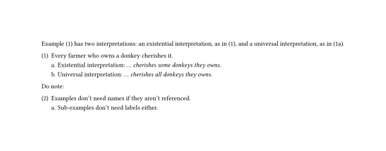

# LingEx 

This is a simple package for numbered example in texts. 

The following snippet illustrates basic functionality: examples, sub-examples and references to these.

```typst
#import "@local/lingex:1.0.0": *

Example #exref("donkey") has two interpretations: an existential interpretation, as in #exref("exists"), and a universal interpretation, as in #exref("universal").

#ex(name: "donkey")[
	Every farmer who owns a donkey cherishes it.
	#a[
		Existential interpretation: _... cherishes some donkeys they owns._
	] <exists>
	#a[
		Universal interpretation: _... cherishes all donkeys they owns._
	] <universal>
]

Do note:

#ex[
	Examples don't need names if they aren't referenced.
	#a[
		Sub-examples don't need labels either.
	]
]
```



Interlinear glosses can be obtained by an independent package [`leipzig-glossing`](https://typst.app/universe/package/leipzig-glossing/)


## Installation

  - Clone the following repository
  - Move it to `$TYPST_LOCAL_PACKAGE/lingex/1.0.0` where `$TYPST_LOCAL_PACKAGE` depends on your platform (as described [here](https://github.com/typst/packages/blob/main/README.md#local-packages))